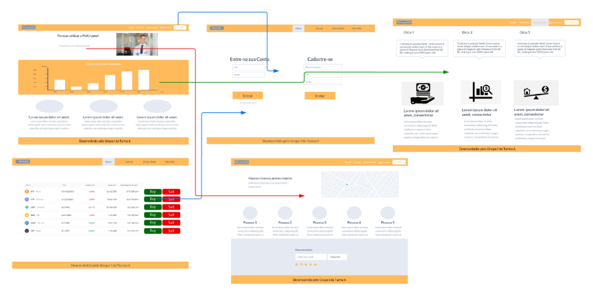
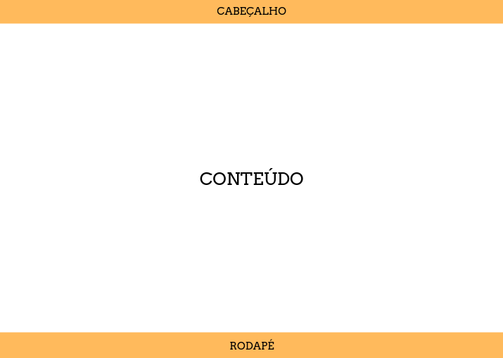
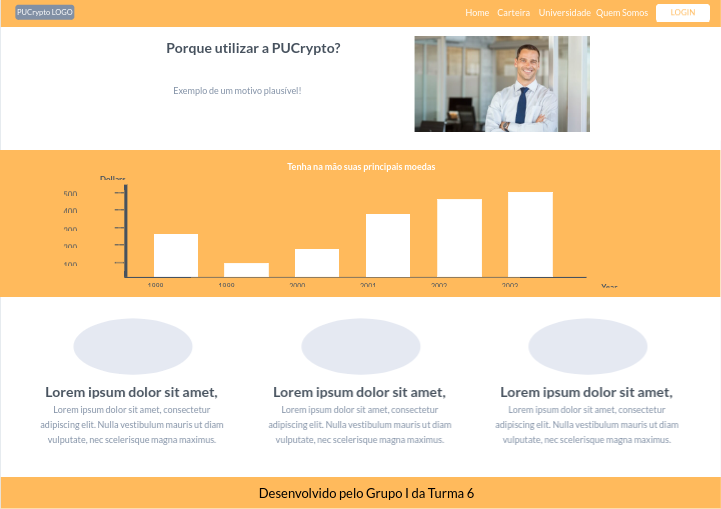
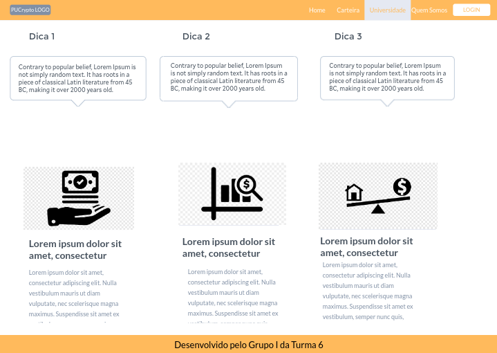
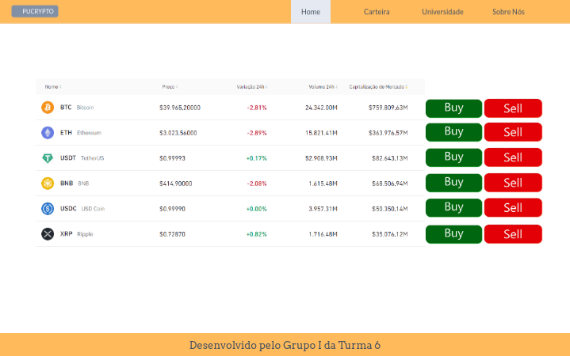
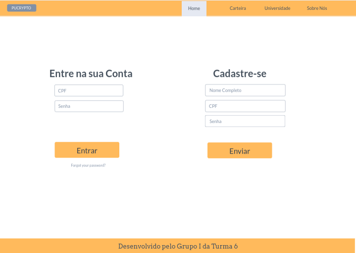
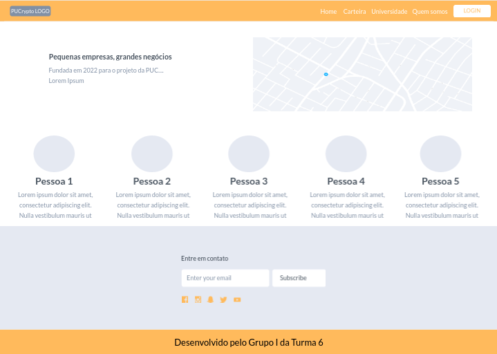

# Projeto de Interface

Dentre as preocupações para a montagem da interface do sistema, estamos estabelecendo foco em questões como agilidade, acessibilidade e usabilidade. Desta forma, o projeto tem uma identidade visual padronizada em todas as telas que são projetadas para funcionamento em desktops e dispositivos móveis. 

## Fluxo do Usuário

O diagrama apresentado na Figura 04 mostra o fluxo de interação do usuário pelas telas do sistema. Cada uma das telas deste fluxo é detalhada na seção de Wireframes que se segue. Para visualizar o wireframe interativo, acesse o [ambiente MarvelApp do projeto](https://marvelapp.com/prototype/i41ajjb). 

 

## Wireframes

Conforme fluxo de telas do projeto, apresentado no item anterior, as telas do sistema são apresentadas em detalhes nos itens que se seguem. As telas do sistema apresentam uma estrutura comum que é apresentada na Figura 05. Nesta estrutura, existem 3 grandes blocos, descritos a seguir. São eles: 

* Cabeçalho - local onde são dispostos elementos fixos de identidade (logo) e navegação principal do site (menu da aplicação);
* Conteúdo - apresenta o conteúdo da tela em questão; 
* Rodapé - apresenta informações de quem criou a plataforma.

 
### Tela - Home-Page

Com base na estrutura padrão, o bloco de cabeçalho apresenta o menú de navegação na plataforma. O bloco conteúdo mostrará informações sobre as principais criptomoedas do mercado e pequenos motivos para o usuário utilizar a plataforma, apresentando gráficos e imagens. Por fim, o bloco de rodapé mostrará informações de quem fez a página.

[

### Tela - Universidade

A tela de universidade apresenta, no Bloco de Conteúdo, as dicas de investimento no mercado de criptomoedas. 

### Tela - Carteira

A carteira é onde o usuário irá realizar todas as operações inerentes ao mercado de criptomoedas (venda e compra). Também poderá acompanhar suas criptomoedas favoritas. A figura a seguir apresenta como será esta página:

### Tela - Login

A tela de Login, no Bloco de Conteúdo, duas opções. A primeira é a opção de login, onde o usuário entrará com suas informações (CPF e Senha) para entrar na plataforma. A segunda é a opção de cadastro, onde o usuário informará suas informações (Nome Completo, CPF, E-mail e Senha) para ele ser cadastrado na plataforma. A figura a seguir apresenta como será esta página: 

### Tela - Sobre Nós

Está página apresenta informações sobre a equipe de desenvolvimento do projeto e informações para o usuário entrar em contato. A figura a seguir apresenta como será esta página: 

