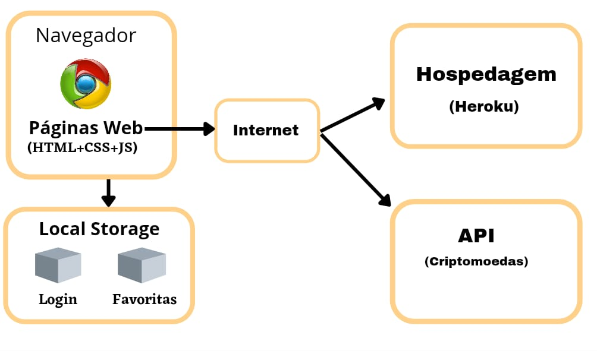

# Arquitetura da Solução

Nesta seção são apresentados os detalhes técnicos da solução criada pela equipe, tratando dos componentes que fazem parte da solução e do ambiente de hospedagem da solução. 

## Diagrama de componentes

Diagrama que permite a modelagem física de um sistema, através da visão dos seus componentes e relacionamentos entre os mesmos.

Exemplo: 

Os componentes que fazem parte da solução são apresentados na Figura que se segue.

Figura XX - Arquitetura da Solução

A solução implementada conta com os seguintes módulos:
- **Navegador** - Interface básica do sistema  
  - **Páginas Web** - Conjunto de arquivos HTML, CSS, JavaScript e imagens que implementam as funcionalidades do sistema.
   - **Local Storage** - armazenamento mantido no Navegador, onde são implementados bancos de dados baseados em JSON. São eles: 
     - **Login** - registro de informações do usuário;
     - **Favoritas** - registro de criptomoedas favoritas do usuário.
 - **API** - ferramenta que permitirá a atualização em tempo real dos valores das criptomoedas.
 - **Hospedagem** - local na Internet onde as páginas são mantidas e acessadas pelo navegador. 

## Tecnologias Utilizadas

A seguir, são apresentadas algumas tecnologias que serão utilizadas para desenvolver e controlar o projeto:

* HTML. CSS e Javascript: tecnologias para desenvolvimento Front-End;
* Git e Github: tecnologia para controle e versionamento do código;
* Visual Studio Code: IDE de desenvolvimento;
* Trello: para a correta gestão da equipe e distribuição de tarefas;
* Marvel App: Design de protótipos.

## Hospedagem

O site utilizará a plataforma do Heroku como ambiente de hospedagem do site do projeto. A publicação do site no Heroku é feita por meio de uma submissão do projeto (push) via git para o repositório remoto que se encontra no endereço:  https://github.com/ICEI-PUC-Minas-PMV-ADS/pmv-ads-2022-1-e1-proj-web-t6-grupo_1_pucrypto 
